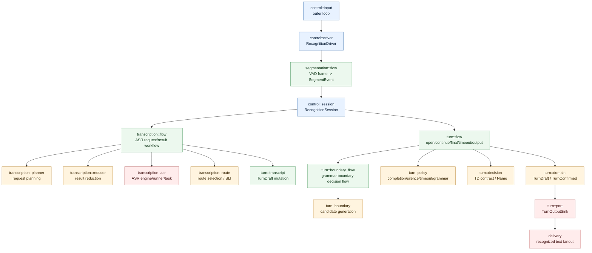

# recognition モジュール俯瞰

`recognition/` は、AI 部品名ではなく pipeline stage で読む。

```text
recognition/
  control/
  segmentation/
  transcription/
  turn/
```



## 境界

- `control/`: production orchestration、session state、driver priority。runtime config は dirty bit で差分を分類し、audio / VAD / driver の必要な経路だけへ反映する。
- `segmentation/`: audio stream / VAD frame から segment event を作る。
- `transcription/`: segment / turn audio を ASR に投げ、result を workflow action として処理する。
- `turn/`: transcript を Turn 状態へ反映し、continue / final / output を決める。debug badge のような表示用 payload は runtime event contract に含めない。

## 不変条件

- ASR in-flight は 1 件だけ。
- pending turn check は queue ではなく 1 slot。新しい check は stale 判定用 epoch を持つ現在値として扱う。
- ASR result は request identity が一致してから適用する。
- stale ASR result / stale output は downstream へ流さない。
- Namo Continue 後の発話 activity 中は timeout final しない。
- grammar boundary は completion ASR の末尾候補だけを Turn 完了に使い、途中候補では Turn を open のまま維持する。

## 設計判断

- `RecognitionDriverHandle` は `control/input.rs` が使う boxed driver interface として残す。audio worker と recognition driver の境界を狭く保つため。
- `transcription/asr/task.rs` の request metadata は、workflow-level と engine-only に過剰分割しない。2 つ目以降の concrete engine 差分が明確になった時点で分ける。
- route / SLI の session tests は `control/tests` 配下に置く。`RecognitionSession` の state mutation と production harness 上の event order を合わせて見るため。
- `TurnDecision` は `is_end_of_turn` と `confidence` の最小契約にする。Namo response label や tokenizer details は engine 固有実装に閉じる。
- turn lifecycle から ASR rerecognition dispatch へ進む bridge は `RecognitionSession` に置く。turn stage が request queue の内部構造を直接所有しないため。
