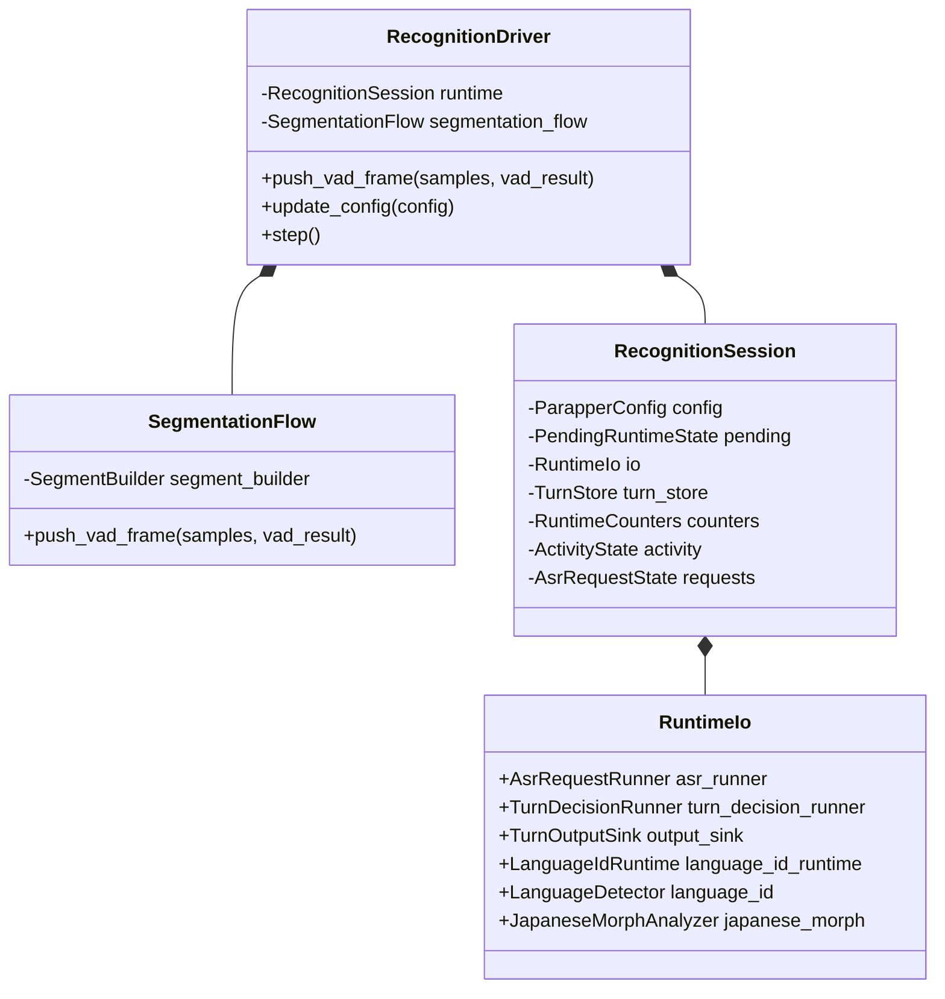
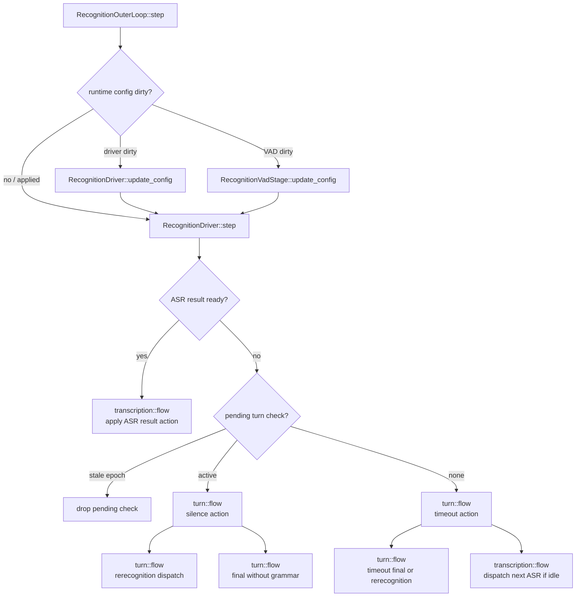
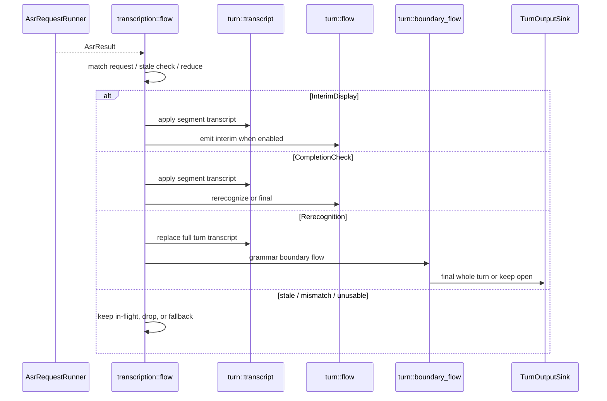

# recognition 内部詳細

`RecognitionSession` は state holder、`RecognitionDriver` は event order / step priority を持つ。
個別 workflow は stage module の `flow.rs` に分散している。

## Session 状態

## step 優先順位

`RecognitionOuterLoop` は各 step の先頭で frontend からの config 更新を 1 回だけ取り出す。dirty bit に応じて、audio-only 設定は `AudioInputProcessor` の参照 config だけを差し替え、VAD 閾値変更は `RecognitionVadStage`、ASR / turn / delivery に関わる変更は `RecognitionDriver::update_config` へ渡す。

## ASR result から output まで

## 読み方

- ASR の engine / runner / task 型は `transcription/asr/`。
- request queue、in-flight、result action 適用は `transcription/flow.rs`。
- TurnDraft mutation は `turn/transcript.rs`。
- open turn lifecycle と timeout は `turn/flow.rs`。
- grammar boundary decision は `turn/boundary_flow.rs`。
- `PendingRuntimeState::turn_check` は単一 slot。stale な check を drain する queue として扱わない。
