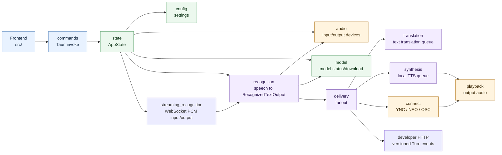

# src 全体俯瞰

Tauri backend の `src-tauri/src` を、人間が最初に読むための粒度でまとめた図。
矢印は「主な呼び出し / データの流れ」を表し、細かい helper 依存は省略する。

## 読み方

- `recognition` は音声を文字起こしして `RecognizedTextOutput` を作るまで。
- `delivery` は認識結果を UI、翻訳、音声合成、外部連携へ配る境界。
- `connect` は外部 API / plugin HTTP / OSC などの接続先仕様を扱う。
- `audio` は入力と出力の両方で参照されるため、矢印が集まりやすい。
- `streaming_recognition` は `/ws/recognition` のbinary PCM入力とversioned Turn event出力を扱い、物理入力と同じrecognition pipelineを利用する。
- `translation` / `synthesis` はmanagerからlocal/YNCを直接分岐せず、能力別provider registryで解決する。
- 外部向け翻訳HTTP listenerは`AppState`が所有し、ユーザーの明示Start / Stopでのみportを開く。内部翻訳の有効化とは独立している。
