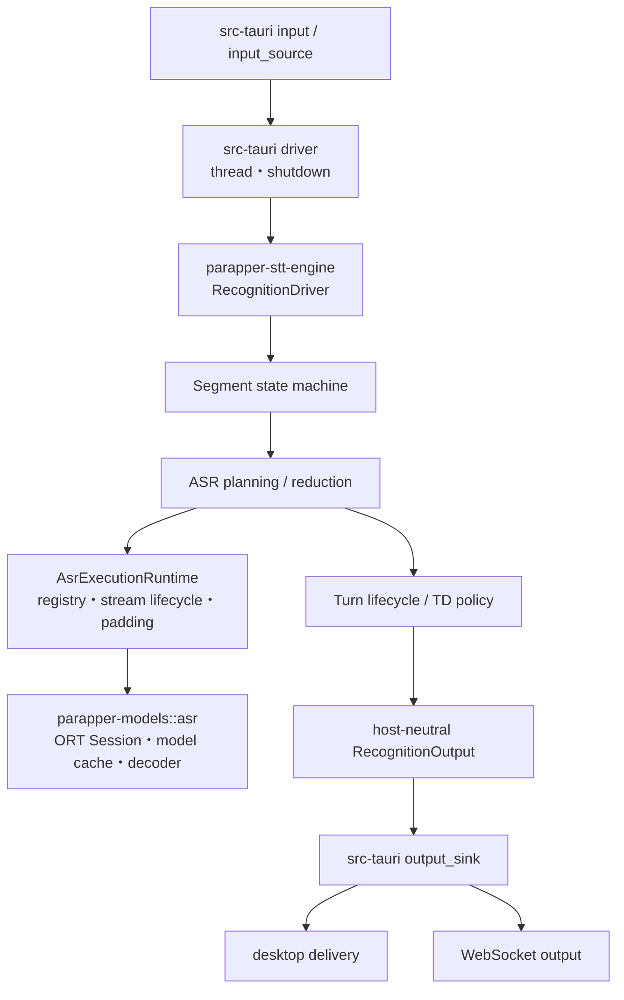

# recognitionモジュール俯瞰

recognitionは、再利用可能なSTT coreとdesktop host adapterの2層で構成する。

```text
crates/parapper-stt-engine/src/
  asr.rs                 ASR model registry / request実行 / streaming lifecycle
  segmentation/          VAD frame -> Segment event
  transcription/         request planning / route / result reduction / preprocessing
  turn/                  Turn state / grammar / Namo / silence / timeout
  session.rs             STT runtime stateとport
  driver.rs              non-blocking step priority

src-tauri/src/recognition/
  config.rs              ParapperConfig -> SttEngineConfig
  session.rs             composition root
  driver.rs              blocking loop / shutdown deadline
  model_factory.rs       Tauri path解決とnative model構築
  asr_worker.rs          ASR worker thread / queue / clock / warning event
  language_adapter.rs    SLIの構築とwarning adapter
  turn_adapter.rs        Namo/Morphの構築とport adapter
  input.rs               audio/network入力処理
  input_source.rs        bounded inputと切断policy
  output_sink.rs         desktop/WebSocket output接続
  events.rs              Tauri event DTOとemit
  streaming.rs           parapper-stt-serverのdesktop adapter
```

## 依存とデータフロー



依存は`src-tauri -> parapper-stt-engine -> parapper-models`の一方向とする。`parapper-stt-engine`はTauri型、生のORT Session、filesystem path、worker threadを参照しない。

## 状態の所有権

- AIモデル固有のアルゴリズム状態（ORT Session、cache tensor、decoder state）: `parapper-models`
- STTとしてmodelを使うアルゴリズム状態（registry、STT/model Session ID対応、streaming lifecycle、先頭padding、request policy）: `parapper-stt-engine`
- OS/Tauri/thread/resourceとの接続（path解決、model構築、queue、clock、event、shutdown）: `src-tauri`

desktopはrecognition開始時に必要なmodelを構築してengineへ注入する。request処理中に新しいmodel Sessionを遅延生成しない。停止後のmodel再構築と、実行中に許可するparameter更新の詳細は独立したconfig変更で扱う。

## 不変条件

- ASR in-flightは1件だけ。
- pending turn checkはqueueではなく1 slotで、stale判定用epochを持つ。
- ASR resultはrequest identityが一致してから適用する。
- stale ASR result / stale outputをdownstreamへ流さない。
- Namo Continue後のspeech activity中はtimeout finalしない。
- Nemotronのinterim streamは明示的にstartし、completion、reset、shutdown、失敗時にcancelする。
- completionはstreamのfinish結果ではなく、source audioに対するfull offline ASRを使用する。

## テスト所有権

Segment/Turn、request planning、streaming lifecycle、padding、route、reducerの回帰テストは`parapper-stt-engine`に置く。`src-tauri`側はnative resourceの構築、worker/queue、inputとshutdown、Tauri event、desktop/WebSocket outputの接続だけをテストする。

詳細な境界は[05-parapper-engine-boundary.md](05-parapper-engine-boundary.md)を参照。
