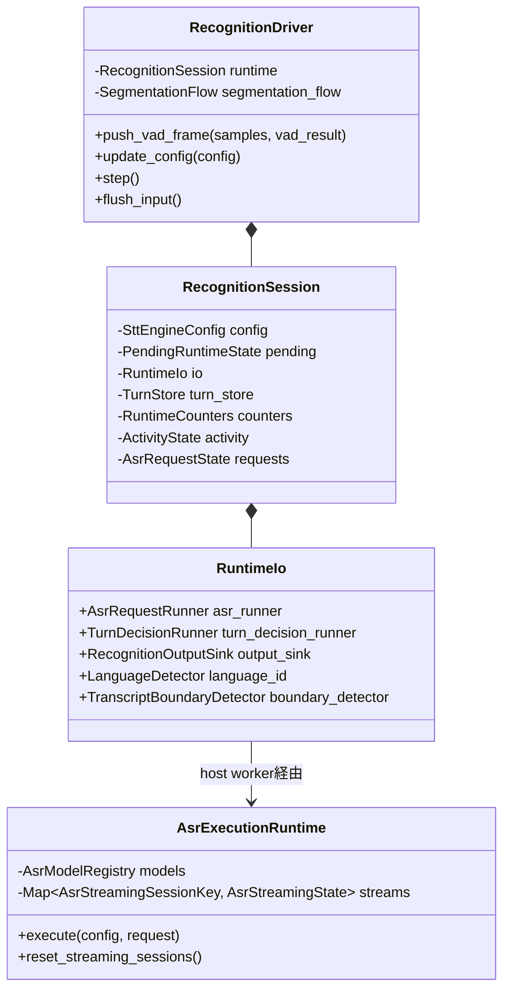
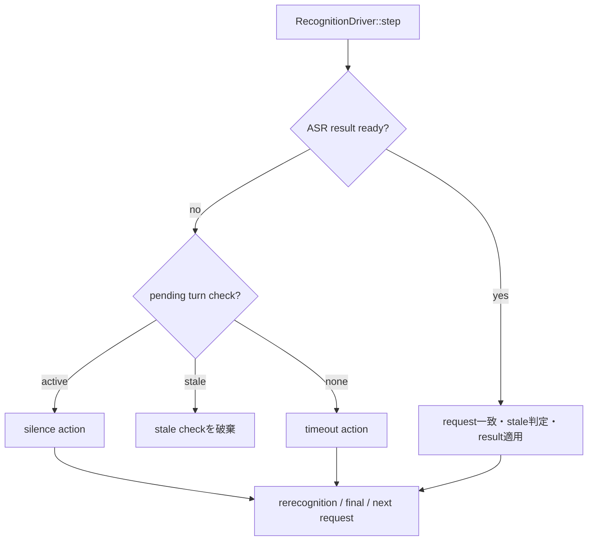
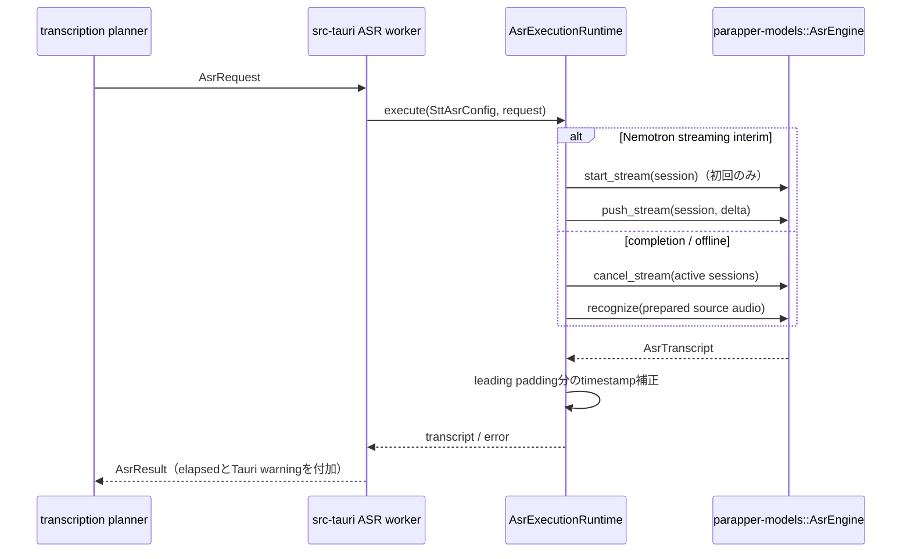
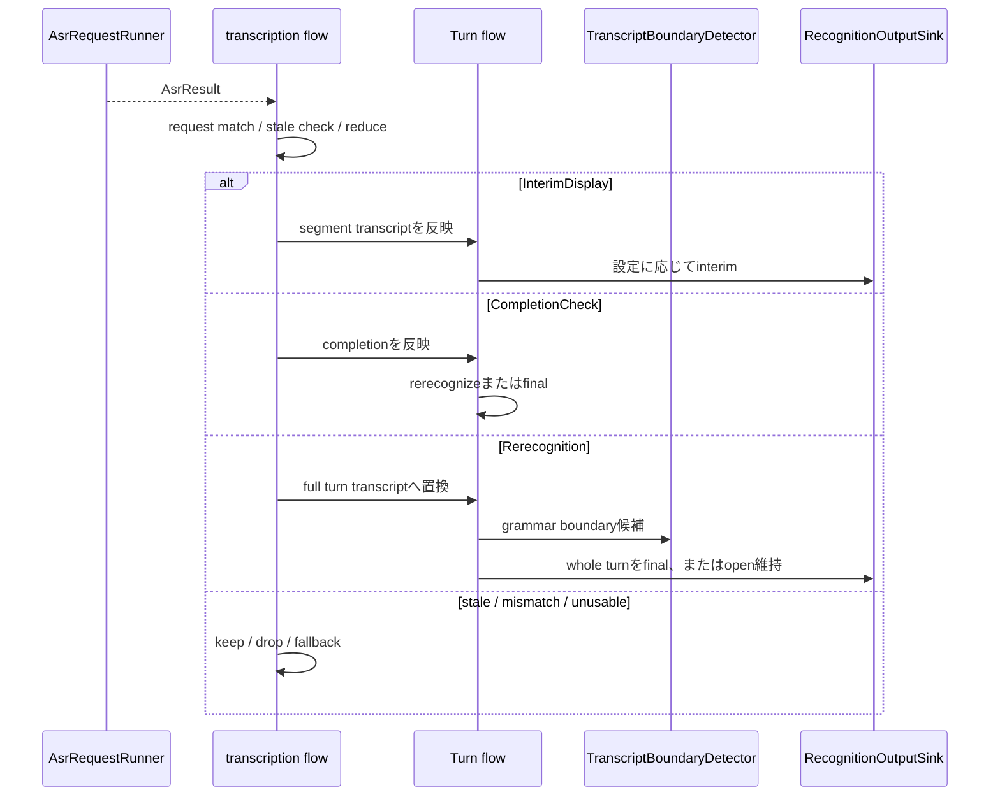

# recognition内部詳細

STTの状態遷移は`parapper-stt-engine`にあり、desktop側は`RecognitionDriver`を駆動する。`RecognitionSession`はstate holder、`RecognitionDriver`はevent order / step priority、`AsrExecutionRuntime`は構築済みASR modelの利用policyを持つ。

## Session状態

## step優先順位

desktop outer loopはfrontendからのconfig更新を取り出し、audio/VAD/driverへ必要な更新だけを渡す。engine driverの1 stepは次の優先順位を守る。

activityは小さなbounded job queueに流さず、epochとして更新する。Namo Continue後に`SegmentStarted` / `SegmentExtended`が来た場合はtimeout起点を更新し、active speech中の誤finalを防ぐ。

## ASR request実行

model registryとstreaming stateはengineに1つだけ置く。desktop側で同じSession keyのmapを重ねず、model APIのstart/push/cancelをengineから明示的に呼ぶ。ORT SessionやNemotron encoder cacheは`parapper-models`内部から出さない。

## ASR resultからoutputまで

## 読み方

- model固有推論: `crates/parapper-models/src/asr/`
- ASR実行policy: `crates/parapper-stt-engine/src/asr.rs`
- request planning/reduction/preprocessing: `crates/parapper-stt-engine/src/transcription/`
- Turn lifecycle: `crates/parapper-stt-engine/src/turn/`
- desktop composition/worker: `src-tauri/src/recognition/session.rs`と`asr_worker.rs`
- desktop入出力: `src-tauri/src/recognition/input.rs`と`output_sink.rs`
