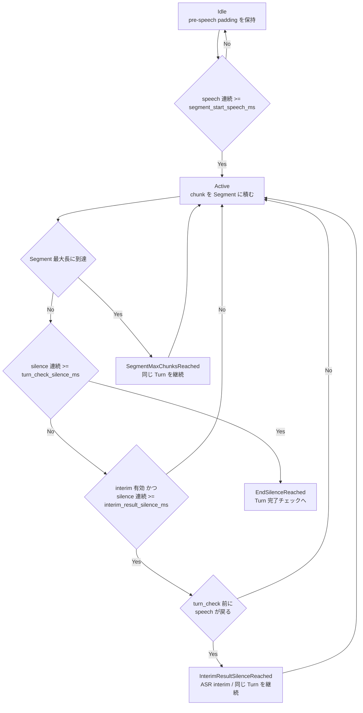
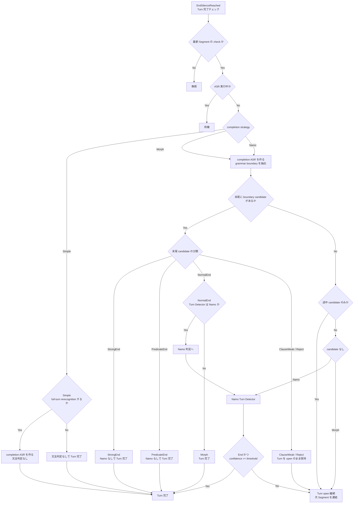

# Japanese Separate Rule

この文書は、日本語 ASR の発話区切りについて、VAD の無音・発話期間、文法境界、Namo Turn Detector の役割を整理する。

## 用語

- `Segment`: ASR に 1 回投げる音声単位。
- `Turn`: ユーザー発話のまとまり。複数の `Segment` が 1 つの `Turn` に連結されることがある。
- `TurnDraft`: まだ完了していない mutable な Turn 状態。
- `TurnConfirmed`: 完了済みで immutable な Turn 状態。
- `completion ASR`: Turn 完了判定のため、必要に応じて Turn 全体を再認識した ASR 結果。
- `grammar boundary`: completion ASR の token から推定した文法上の境界候補。
- `Namo`: 文末らしさを判定する Turn Detector。

## VAD の基本ルール

VAD は `vad_interval_ms` ごとの chunk を発話・無音として扱う。ms から chunk 数への変換は `ceil(ms / vad_interval_ms)` で、最低 1 chunk になる。

### 発話開始

Idle 中は直近の無音を pre-speech padding として保持する。連続した speech chunk が `segment_start_speech_ms` 以上になると `SegmentStarted` を発行し、Active に入る。

`segment_start_speech_ms` 未満の短い speech は Segment として開始されない。

### 発話継続

Active 中は speech / silence に関係なく音声 chunk を Segment に積み続け、進捗として `SegmentExtended` を発行する。

### 短い無音による interim

`interim_result_enabled` が有効で、Active 中の無音が `interim_result_silence_ms` 以上になったあと、`turn_check_silence_ms` に到達する前に speech が戻ると、現在の Segment を `InterimResultSilenceReached` として閉じる。

この Segment は途中経過表示用であり、Turn を完了・分割する条件ではない。次の Segment は `previous_segment_id` を持ち、同じ Turn に連結される。

### Turn 完了チェックに進む無音

Active 中の無音が `turn_check_silence_ms` 以上になると、現在の Segment を `EndSilenceReached` として閉じる。この時点で VAD レベルでは発話候補が閉じ、Turn 完了判定に進む。

ただし `turn_check_silence_ms` は Turn を即 final にする条件ではない。Namo や文法判定が Continue を返した場合、Turn は open のまま保持される。

### 長すぎる Segment

1 Segment が最大長に達すると `SegmentMaxChunksReached` で閉じる。これは ASR 投入単位を切るための条件であり、Turn 完了条件ではない。次の Segment は同じ Turn に連結される。

## Turn 完了チェックの流れ

`EndSilenceReached` 後の Turn 完了チェックでは、古い Segment 由来の stale な check は無視する。対象 Turn の最新 Segment と check 対象 Segment が一致している場合だけ処理する。

ASR がまだ走っている場合は完了判断を待つ。確定に使える completion ASR がない場合、pending interim を completion 候補へ昇格できるときは昇格する。

完了方式は設定により異なる。

| Turn Detector | 完了判定                                                                                                                                              |
| ------------- | ----------------------------------------------------------------------------------------------------------------------------------------------------- |
| `Simple`      | 必要なら full-turn rerecognition を行い、その結果で Turn を完了する。再認識しない設定では文法判定なしで完了する。                                     |
| `Morph`       | full-turn rerecognition と grammar boundary だけを使う。`StrongEnd` / `PredicateEnd` / `NormalEnd` は文法で完了し、Namo は使わない。                  |
| `Namo`        | full-turn rerecognition と grammar boundary を使う。`StrongEnd` / `PredicateEnd` は文法で完了し、`NormalEnd` と境界候補なしは Namo に最終判断させる。 |

## 文法境界の分類

日本語の token は主に次のクラスへ分類される。

### StrongEnd

強い文末。completion ASR の末尾が `StrongEnd` の場合は、Namo を挟まず Turn を完了する。

代表例:

- `。`, `！`, `？`, `.`, `!`, `?`
- 句点扱いの補助記号
- 終助詞
- 単独応答としての `はい`, `うん`, `ええ`, `いいえ`

### PredicateEnd

述語として文末になり得る境界。completion ASR の末尾が `PredicateEnd` の場合は、Namo を挟まず Turn を完了する。

代表例:

- 動詞・形容詞・助動詞の終止形
- 命令形
- 意志推量形
- 後続 token が述語の継続として扱えない場合の一部の連体形

completion ASR の途中にある `PredicateEnd` は、後続が接続表現かどうかに関係なく Turn 分割には使わない。判定対象は末尾候補だけである。

### NormalEnd

弱い文末候補。completion ASR の末尾が `NormalEnd` の場合、`Namo` では Namo に最終判断を渡し、`Morph` では文法だけで Turn を完了する。

代表例:

- 末尾の名詞・代名詞
- 末尾の名詞的な接尾辞
- 末尾の形状詞
- 特別扱いされない感動詞

### ClauseWeak

節の途中として扱う弱い境界。末尾が `ClauseWeak` の場合は Turn を open のまま保持する。

代表例:

- 末尾の読点
- 末尾の接続助詞

### Reject

文末として採用しない境界。末尾が `Reject` の場合は Turn を open のまま保持する。

代表例:

- 末尾の格助詞、係助詞、副助詞、準体助詞
- 末尾の未然形、連用形、仮定形
- 末尾の連体形
- 末尾の接頭辞、連体詞

## 文法分割のルール

Turn 完了判定で使う文法境界は、completion ASR の末尾にある候補だけを採用する。

completion ASR の途中に `StrongEnd` / `PredicateEnd` / `NormalEnd` が見つかっても、その位置では Turn を分割しない。後ろに文字が残っている候補は末尾候補ではないため、Turn を open のまま保持する。

このため、次のような途中分割はしない。

- `ooしようとしたら` を `ooしよう` / `としたら` に分割しない。
- `〇〇なんですけど` を `〇〇` / `なんですけど` に分割しない。

末尾候補に対する動作は次の通り。

| completion ASR 末尾 | `Namo`         | `Morph`        |
| ------------------- | -------------- | -------------- |
| `StrongEnd`         | Turn 完了      | Turn 完了      |
| `PredicateEnd`      | Turn 完了      | Turn 完了      |
| `NormalEnd`         | Namo 判定      | Turn 完了      |
| `ClauseWeak`        | Turn open 継続 | Turn open 継続 |
| `Reject`            | Turn open 継続 | Turn open 継続 |
| 境界候補なし        | Namo 判定      | Turn open 継続 |

末尾の `StrongEnd` / `PredicateEnd` で完了する場合、Turn 全体を final にする。途中の境界候補で prefix / suffix に割る挙動は、現在の日本語 Turn 完了ポリシーでは使わない。

## Namo を使うルール

Namo は、文法だけでは Turn 完了を確定しない場合に使う。`Namo` でもまず grammar boundary を評価し、文法で確定できない場合だけ completion ASR 全体を Namo に渡す。

`Namo` で Namo モデルを使う主なケース:

- completion ASR の末尾が `NormalEnd`
- completion ASR に文法境界候補がない初回判定
- open Turn が timeout final に倒れる前の最終確認

Namo が End と判断し、confidence が設定 threshold 以上なら Turn を完了する。Continue と判断した場合、Turn は open のまま保持される。

Namo Continue 後に次の発話が入った場合、その次の `SegmentClosed` は同じ Turn に連結される。Continue 後に発話 activity が続いている間は timeout final しない。

Namo Continue 後、次の Segment activity がない場合だけ、`turn_check_silence_ms * 2` 相当の timeout で final に倒す。`Morph` / `Namo` では、この timeout final でも必要に応じて rerecognition を行ってから確定する。

## 判定フローチャート

### VAD から Turn 完了チェックまで

### 文法境界と Namo の完了判定

途中 candidate のみの場合は、候補の分類が `StrongEnd` / `PredicateEnd` / `NormalEnd` であってもそこで分割しない。判定対象は completion ASR の末尾 candidate に限定する。

## 代表ケース

| 状況                                                                                 | 結果                                         |
| ------------------------------------------------------------------------------------ | -------------------------------------------- |
| speech が `segment_start_speech_ms` 未満                                             | Segment を開始しない                         |
| speech が `segment_start_speech_ms` 以上                                             | `SegmentStarted`                             |
| Active 中に短い無音がある                                                            | Segment を継続                               |
| `interim_result_silence_ms` 以上の無音後、`turn_check_silence_ms` 前に speech が戻る | interim Segment として閉じ、同じ Turn を継続 |
| 無音が `turn_check_silence_ms` 以上                                                  | Turn 完了チェックへ進む                      |
| completion ASR 末尾が `StrongEnd`                                                    | Turn 完了                                    |
| completion ASR 末尾が `PredicateEnd`                                                 | Turn 完了                                    |
| completion ASR 途中に `PredicateEnd` があり後続がある                                | 分割せず Turn 継続                           |
| completion ASR 途中に `NormalEnd` があり後続がある                                   | Namo に渡さず Turn 継続                      |
| completion ASR 末尾が `NormalEnd` かつ `Namo`                                        | Namo で End / Continue 判定                  |
| completion ASR 末尾が `NormalEnd` かつ `Morph`                                       | Turn 完了                                    |
| Namo Continue 後に発話が続く                                                         | 同じ Turn に連結                             |
| Namo Continue 後に activity がない                                                   | `turn_check_silence_ms * 2` で timeout final |

## 実装参照

- VAD Segment 構築: `src-tauri/src/recognition/segmentation/segment/builder/`
- Turn silence policy: `src-tauri/src/recognition/turn/policy/silence.rs`
- Turn timeout policy: `src-tauri/src/recognition/turn/policy/timeout.rs`
- Grammar policy: `src-tauri/src/recognition/turn/policy/grammar.rs`
- Boundary flow: `src-tauri/src/recognition/turn/boundary_flow.rs`
- Japanese boundary classifier: `src-tauri/src/recognition/turn/boundary/japanese.rs`
